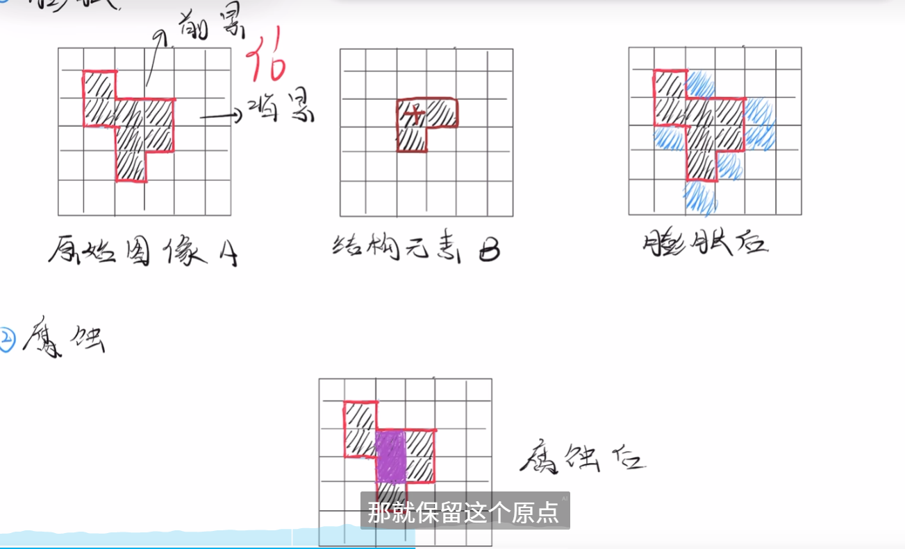

# 图像滤波与形态变换（考试重点整理）

## 一、图像与波的关系

### 1. 图像的波形表示
- **基本思想**：图像可以看作是色彩波的叠加
- **降维表示**：将图像每一行的RGB值分别绘制成三条曲线
- **关键观察**：
  - 曲线波动较小的区域 → 图像平滑区域
  - 曲线大幅波动的区域 → 图像突变/边缘区域
- 图像本质上就图像本质上就是各种色彩波的叠加

### 2. 频率概念
- **低频信号**：整体上的缓慢变化（图像主体内容）
- **高频信号**：局部上的快速变化（图像细节、边缘、噪声）

## 二、滤波器基础

### 1. 滤波器类型
| 滤波器类型 | 作用 | 图像效果 |
|------------|------|----------|
| **低通滤波器** | 保留低频，抑制高频 | 图像模糊、去噪 |
| **高通滤波器** | 保留高频，抑制低频 | 边缘检测、锐化 |

### 2. 滤波应用
- **低通滤波**：美颜、去噪、马赛克
- **高通滤波**：边缘检测、图像锐化

## 三、图像模糊（低通滤波）方法

### 1. 均值滤波（Mean Filter）
- **原理**：计算像素点及其邻域的平均值
- **实现**：遍历每个像素，对其周围窗口内像素求均值
- **特点**：
  - 窗口内所有像素权重相等
  - 简单有效，但会过度模糊边缘

### 2. 高斯滤波（Gaussian Filter）
- **原理**：使用正态分布作为权重进行加权平均
- **二维高斯函数**：
  ```
  G(x,y) = (1/(2πσ²)) * exp(-(x²+y²)/(2σ²))
  ```
- **特点**：
  - 中心像素权重最大，距离越远权重越小
  - 比均值滤波更好地保留边缘效果
  - σ（标准差）控制模糊程度

### 3. 方框滤波（Box Filter）
- **原理**：类似于均值滤波，但可选择是否归一化
- **归一化方框滤波** = 均值滤波
- **非归一化方框滤波**：输出值可能超出原始范围

### 4. 中值滤波（Median Filter）
- **原理**：用邻域像素的中值替代中心像素值
- **特点**：
  - 对椒盐噪声（脉冲噪声）特别有效
  - 能较好保持边缘，不会产生模糊
  - 非线性滤波器

### 5. 双边滤波（Bilateral Filter）
- **原理**：同时考虑空间距离和灰度相似性
- **公式**：
  ```
  h(p) = (1/k) * Σ f(q) * c(p,q) * s(f(p),f(q))
  ```
  - `c(p,q)`：几何距离权重（通常为高斯核）
  - `s(f(p),f(q))`：灰度相似性权重（通常为高斯核）
  - `k`：标准化系数

- **特点**：
  - 保边去噪：在平滑噪声的同时保持边缘
  - 计算复杂度较高
  - 相比现代方法（如BM3D）效果一般，但思想重要

## 四、2D卷积

### 1. 卷积原理
- **过程**：卷积核在图像上滑动，逐点计算加权和
- **单通道卷积**：
  - 输出像素值 = Σ(图像像素 × 对应卷积核权重)
- **多通道卷积**：各通道分别卷积后求和

### 2. 卷积参数关系
- **基本公式**（无padding，stride=1）：
  ```
  Output Size = Input Size - Kernel Size + 1
  ```

- **通用公式**（考虑padding和stride）：
  ```
  Output Size = (Input Size + 2×Padding - Kernel Size) / Stride + 1
  ```

### 3. 边缘检测中的卷积应用
- **核心思想**：使用特定卷积核（算子）检测边缘
- **常用算子**：Roberts、Prewitt、Sobel、Laplacian

## 五、边缘检测（高通滤波应用）

### 1. 边缘检测基础
- **边缘定义**：图像局部特征不连续，亮度变化最显著的部分
- **边缘特性**：
  - **方向**：沿边缘走向灰度变化平缓
  - **幅度**：垂直边缘走向灰度变化剧烈
- **检测原理**：用局部微分技术获得梯度

### 2. 经典边缘检测算子

#### (1) Roberts算子
- **模板大小**：2×2
- **水平模板**：`[[1, 0], [0, -1]]`
- **垂直模板**：`[[0, 1], [-1, 0]]`
- **特点**：对角线方向敏感，但对噪声敏感

#### (2) Prewitt算子
- **模板大小**：3×3
- **水平模板**：
  ```
  [[-1, 0, 1],
   [-1, 0, 1],
   [-1, 0, 1]]
  ```
- **垂直模板**：
  ```
  [[-1, -1, -1],
   [ 0,  0,  0],
   [ 1,  1,  1]]
  ```

#### (3) Sobel算子
- **改进**：中心行/列权重为2，增强噪声抑制
- **水平模板**：
  ```
  [[-1, 0, 1],
   [-2, 0, 2],
   [-1, 0, 1]]
  ```

- **垂直模板**：
  ```
  [[-1, -2, -1],
   [ 0,  0,  0],
   [ 1,  2,  1]]
  ```
- **优势**：比Prewitt更好地平滑噪声

#### (4) Laplacian算子
- **原理**：二阶导数，检测灰度变化速率的变化
- **特点**：
  - 在灰度恒定区域结果为0
  - 在均匀变化区域结果为0  
  - 在变化速率大区域结果显著
- **应用**：图像锐化和边缘检测

- **模板**：
  ```
  [[ 0, 1, 0],
   [ 1,-4, 1],
   [ 0, 1, 0]]

  p5'=(p2+p4+p6+p8)-4×p5
  ```

### 3. MATLAB边缘检测函数
```matlab
BW = edge(I, 'sobel');      % Sobel方法
BW = edge(I, 'prewitt');    % Prewitt方法
BW = edge(I, 'roberts');    % Roberts方法
BW = edge(I, 'log');        % Laplacian of Gaussian
BW = edge(I, 'canny');      % Canny方法（最优）
```

## 六、形态学操作

- 拿B的左上角(举例)当原点,放入原始A中所有位置
- **膨胀**:如果有地方没有,就全补满
- **腐蚀**:如果有地方没有,就全清空

### 1. 膨胀（Dilation）
- **符号**：A ⊕ B
- **原理**：用结构元素B扫描图像A，取覆盖区域的最大值
- **效果**：
  - 白色区域扩大
  - 填充小孔洞
  - 连接邻近物体

### 2. 腐蚀（Erosion）
- **符号**：A ⊖ B
- **原理**：用结构元素B扫描图像A，取覆盖区域的最小值
- **效果**：
  - 白色区域缩小
  - 去除小物体
  - 分离邻近物体

### 3. 骨架提取（Skeletonization）
- **别名**：二值图像细化
- **目的**：将连通区域细化为单像素宽度
- **应用**：
  - 特征提取
  - 目标拓扑表示
  - 字符识别

- **典型算法**：
  - Max-Disc模型
  - Fire模型

- **核心步骤**（基于形态学腐蚀）：
反复腐蚀图像，并在每一步保留那些腐蚀后无法通过开运算恢复的核心部分，最终得到的中轴线结构
形态学骨架并不是记录“被腐蚀掉的点”，而是记录“腐蚀后无法被开运算恢复的核心”

### 4. 形态学组合操作
- **开运算**：先腐蚀后膨胀 → 去除小物体，保持大物体形状
- **闭运算**：先膨胀后腐蚀 → 填充小孔洞，连接邻近物体


## 考试重点总结

### 必考知识点
1. **各种滤波方法的特点和适用场景**
   - 均值滤波 vs 高斯滤波 vs 中值滤波 vs 双边滤波
2. **边缘检测算子的模板和特点**
   - Roberts、Prewitt、Sobel、Laplacian的区别
3. **形态学操作的定义和效果**
   - 膨胀、腐蚀的基本原理和应用场景

### 计算题重点
1. **2D卷积计算**：给定图像和卷积核，计算输出结果
2. **滤波器参数计算**：根据输入、输出、卷积核大小计算padding或stride
3. **边缘检测结果**：应用特定算子到简单图像，得到边缘图

### 应用题重点
1. **噪声类型与滤波器选择**：
   - 高斯噪声 → 高斯滤波
   - 椒盐噪声 → 中值滤波
2. **边缘检测方法选择**：
   - 简单场景 → Sobel/Prewitt
   - 复杂场景 → Canny
3. **形态学操作组合**：
   - 去噪 + 保持形状 → 开运算
   - 填充 + 连接 → 闭运算

> **提示**：重点掌握各种滤波器和边缘检测算子的模板形式，理解它们的设计思想和适用场景。形态学操作要理解膨胀和腐蚀的基本原理，以及它们在实际应用中的组合使用。